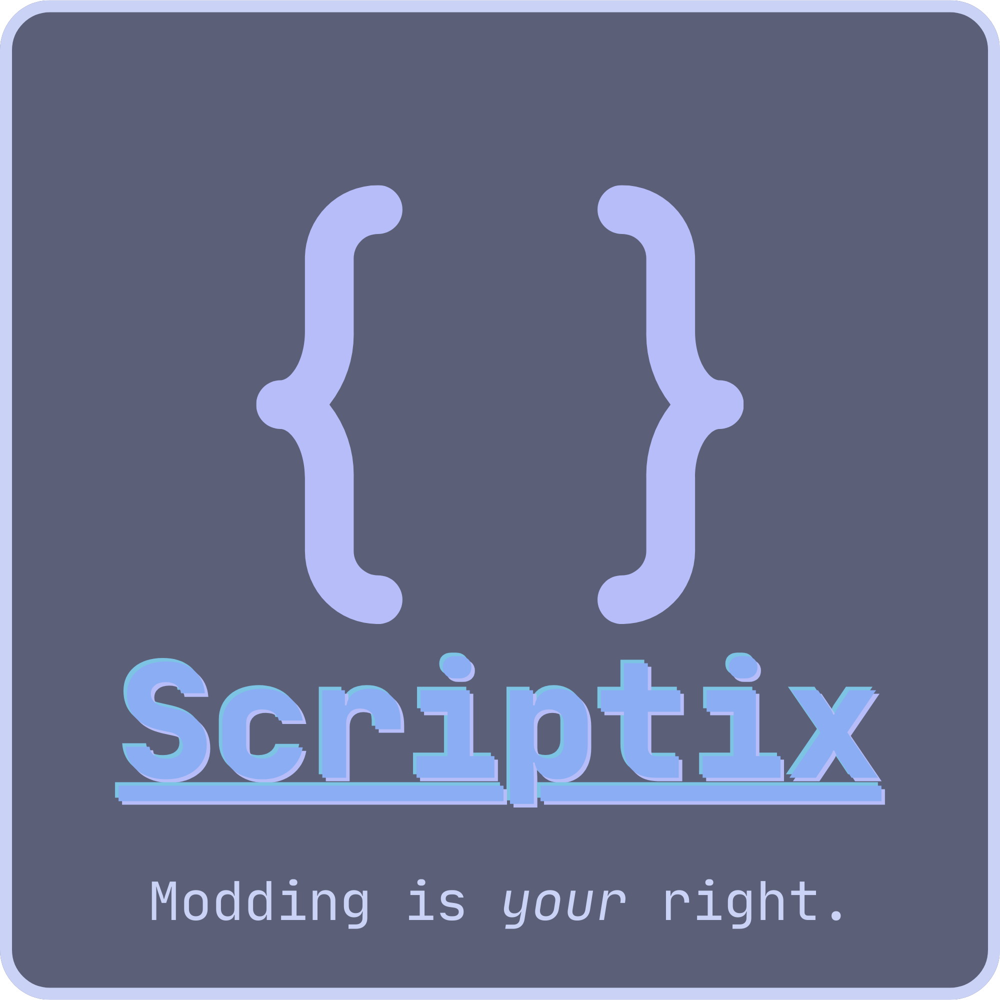
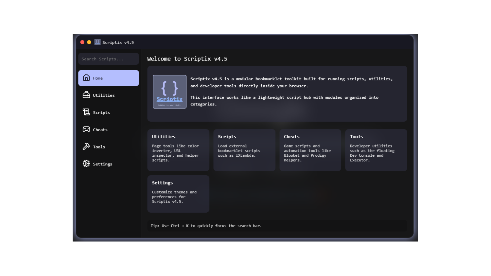

<p align="center">
  
</p>

<h1 align="center">Scriptix</h1>

<p align="center">
  
  
  
</p>

<p align="center">
  <b>A modular bookmarklet toolkit for scripts, utilities, and browser tools</b>
</p>

---

## 🌑 Overview

Scriptix is a **powerful bookmarklet-based UI system** that lets you run scripts, tools, and utilities directly inside your browser.

💡 Think of it as a **mini app launcher overlay for the web**.

Also if you found Scriptix to your advantage, please consider staring this repository

## 📸 Screenshots

<p align="center">
  
</p>

## ✨ Features

<p align="center">

| 🧩 Modular | 🎛️ Custom UI | ⚡ Fast |
|----------|-------------|--------|
| Load scripts dynamically | Draggable & resizable window | Instant execution |

| 🎮 Scripts | 🛠️ Tools | 💾 Persistent Settings |
|----------|---------|----------------------|
| Game helpers & automation | Dev tools & utilities | Saves preferences locally |

</p>

## 🧠 Password
Due tO SUDO and I, TEDA, deciding this operation should be private we've put a password on both our programs, IXLambda and Scriptix, so if you must run it you either need to get the code from SUDO or me. This was made to protect our programs, so please do not hate us for this change. (Also because We wanted to learn cryptography)

Thank you, The Owners of ΦΠΒ

## 📋 Changelog

Go to this link to see the changelog:
<a href="https://github.com/MohanIShim47/Scriptix/releases/tag/v5-BETA">Changelog for Current Version</a>

---

## 💻 Bookmarklet Code

```js
javascript:(function()%7Bvar script %3D document.createElement("script")%3B%0Ascript.src %3D "https%3A%2F%2Fraw-githack-com.translate.goog%2FMohanIShim47%2FScriptix%2Fmain%2Fsrc%2Fmain.js"%3B%0Adocument.head.appendChild(script)%3B%7D)()
